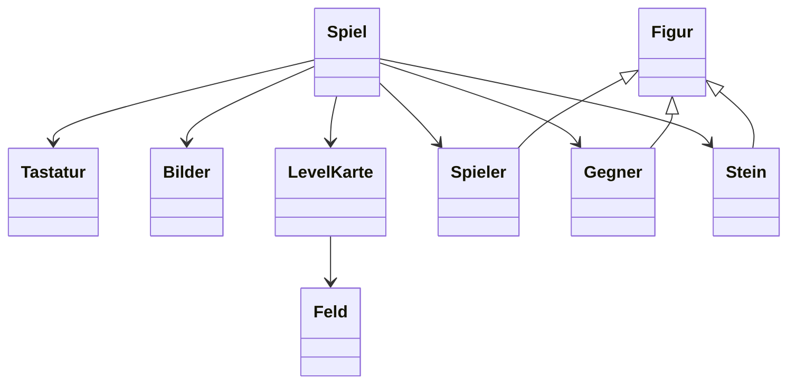

# Crystal Caverns

**Crystal Caverns** ist ein kleines 2D-Retro-Spiel in **C++17** mit **SDL2**.  
Der Spieler bewegt sich durch eine Höhle, sammelt Kristalle, vermeidet Gegner und fallende Steine und erreicht den Ausgang.

GitHub Repository: <https://github.com/Mc-smail/CrystalCaverns>

---

## Spielidee

Das Spiel ist ein Feld-Based-Spiel im Stil klassischer Retro-Höhlenspiele.  
Der Spieler startet in einer Höhle und muss genug Kristalle sammeln, um den Ausgang zu öffnen.

Nach Abschluss von Level 1 startet automatisch ein schwierigeres Level 2.

---

## Spielziel

Pro Level müssen mindestens **7 Kristalle** gesammelt werden. Danach öffnet sich der Ausgang.

Der Spieler verliert ein Leben, wenn:

- er einen Gegner berührt,
- er von einem fallenden Stein getroffen wird,
- der Timer abläuft.

Der Spieler hat **3 Leben**. Bei 0 Leben ist das Spiel vorbei.

---

## Features

- SDL2-Fenster und Renderer
- Spiel Loop: `Input → Update → Render`
- echte SDL-Texturen mit BMP-Sprites
- Feldmap aus Textdateien
- Spielerbewegung mit WASD oder Pfeiltasten
- Kristalle sammeln
- Ausgang öffnet sich nach 7 Kristallen
- zwei Level mit steigender Schwierigkeit
- Gegner mit automatischer Bewegung
- fallende Steine
- 3-Leben-System
- 90-Sekunden-Timer pro Level
- HUD mit Kristallen, Leben und Timer-Leiste
- objektorientierte C++-Struktur

---

## Steuerung

| Taste | Funktion |
|---|---|
| `W` / Pfeil hoch | Spieler nach oben bewegen |
| `A` / Pfeil links | Spieler nach links bewegen |
| `S` / Pfeil runter | Spieler nach unten bewegen |
| `D` / Pfeil rechts | Spieler nach rechts bewegen |
| `R` | Nach Spiel Over / Victory neu starten |
| `ESC` | Spiel beenden |

---

## Level-Zeichen

| Zeichen | Bedeutung |
|---|---|
| `#` | Wand |
| `.` | Erde / begehbares Feld |
| `P` | Spielerstart |
| `C` | Kristall |
| `O` | Stein / Stein |
| `X` | Gegner |
| `E` | Ausgang |

---

## Levelübersicht

| Level | Kristalle | Gegner | Steine | Schwierigkeit |
|---|---:|---:|---:|---|
| Level 1 | 8 | 3 | 4 | Mittel |
| Level 2 | 10 | 3 | 5 | Schwer |

Level 2 ist schwieriger, weil es mehr Kristalle, mehr Steine und engere Wege enthält.

---

## Technische Umsetzung

Das Projekt nutzt zentrale Konzepte aus C++ und 2D Spiel Development:

- SDL Event Handling
- Keyboard State
- Spiel Loop
- Feldmaps
- einfache Kollisionen
- Klassen und Vererbung
- Polymorphismus über `Figur`
- moderne Speicherverwaltung mit `std::unique_ptr`
- Trennung von Header- und Source-Dateien

---

## Architektur

Wichtige Klassen:

| Klasse | Aufgabe |
|---|---|
| `Spiel` | Hauptklasse, Spiel Loop, Levelwechsel, Sieg/Niederlage |
| `Tastatur` | Tastatur- und SDL-Event-Verarbeitung |
| `Bilder` | Laden und Verwalten von BMP-Texturen |
| `Feld` | Einzelnes Feld der Map |
| `LevelKarte` | Lädt und rendert das Level |
| `Figur` | Abstrakte Basisklasse für bewegliche Objekte |
| `Spieler` | Spielerbewegung, Kristalle sammeln |
| `Gegner` | Automatisch bewegter Gegner |
| `Stein` | Fallender Stein |

---

## Vereinfachtes UML-Diagramm



---

## Projektstruktur

```text
CrystalCaverns/
├── CMakeLists.txt
├── README.md
├── assets/
│   ├── levels/
│   │   ├── level01.txt
│   │   └── level02.txt
│   └── sprites/
│       ├── boulder.bmp
│       ├── crystal.bmp
│       ├── dirt.bmp
│       ├── empty.bmp
│       ├── enemy.bmp
│       ├── exit_closed.bmp
│       ├── exit_open.bmp
│       ├── player.bmp
│       └── wall.bmp
├── include/
│   ├── Stein.hpp
│   ├── Gegner.hpp
│   ├── Figur.hpp
│   ├── Spiel.hpp
│   ├── Tastatur.hpp
│   ├── Spieler.hpp
│   ├── Bilder.hpp
│   ├── Feld.hpp
│   ├── LevelKarte.hpp
│   └── Datentypen.hpp
└── src/
    ├── Stein.cpp
    ├── Gegner.cpp
    ├── Figur.cpp
    ├── Spiel.cpp
    ├── Tastatur.cpp
    ├── SpielStart.cpp
    ├── Spieler.cpp
    ├── Bilder.cpp
    ├── Feld.cpp
    └── LevelKarte.cpp
```

---

## Build auf macOS

Voraussetzungen:

```bash
brew install cmake sdl2
```

Build und Start:

```bash
git clone https://github.com/Mc-smail/CrystalCaverns.git
cd CrystalCaverns
mkdir -p build
cd build
cmake ..
cmake --build .
cd ..
./build/CrystalCaverns
```

---

## Build auf Ubuntu / Kali / Debian

```bash
sudo apt update
sudo apt install -y build-essential cmake libsdl2-dev

git clone https://github.com/Mc-smail/CrystalCaverns.git
cd CrystalCaverns
mkdir -p build
cd build
cmake ..
cmake --build .
cd ..
./build/CrystalCaverns
```

---

## Grafik / SDL-Rendering

Die aktuelle Version benutzt echte SDL-Grafikdateien im BMP-Format. Dadurch wird keine Zusatzbibliothek wie SDL2_image benötigt.

Die Texturen werden über `Bilder` geladen:

```cpp
SDL_Surface* surface = SDL_LoadBMP(path.c_str());
SDL_Texture* texture = SDL_CreateTextureFromSurface(renderer, surface);
SDL_RenderCopy(renderer, texture, nullptr, &rect);
```

---

## Wichtige Codeidee: Spiel Loop

```cpp
while (running) {
    handleEvents();
    update(deltaTime);
    render();
}
```

Die Spiel Loop besteht aus:

1. **Input:** Tastatur und SDL-Events lesen.
2. **Update:** Weltzustand, Gegner, Steine, Timer und Kollisionen aktualisieren.
3. **Render:** Feldmap, Spieler, Gegner, Steine und HUD zeichnen.

---

## Erweiterungsmöglichkeiten

- mehr Level
- Menü mit Text über SDL_ttf
- Soundeffekte mit SDL_mixer
- bessere Gegner-KI
- Highscore-System
- Level-Editor
- Animationen mit Spritesheets
- Schlüssel-Tür-System
- verschiedene Steinarten
- zufällig generierte Höhlen

---

## Fazit

Crystal Caverns ist ein kleines, aber vollständiges C++/SDL2-Spielprojekt.  
Es zeigt Spiel Loop, Input, Rendering, Feldmaps, Kollisionen, Entities und objektorientierte Struktur in einem praktischen Spiel.

## Level Validation

Level text files can be checked without launching the game:

```bash
python3 tools/validate_levels.py
```

The validator checks row widths, allowed map characters and required player/exit markers.
