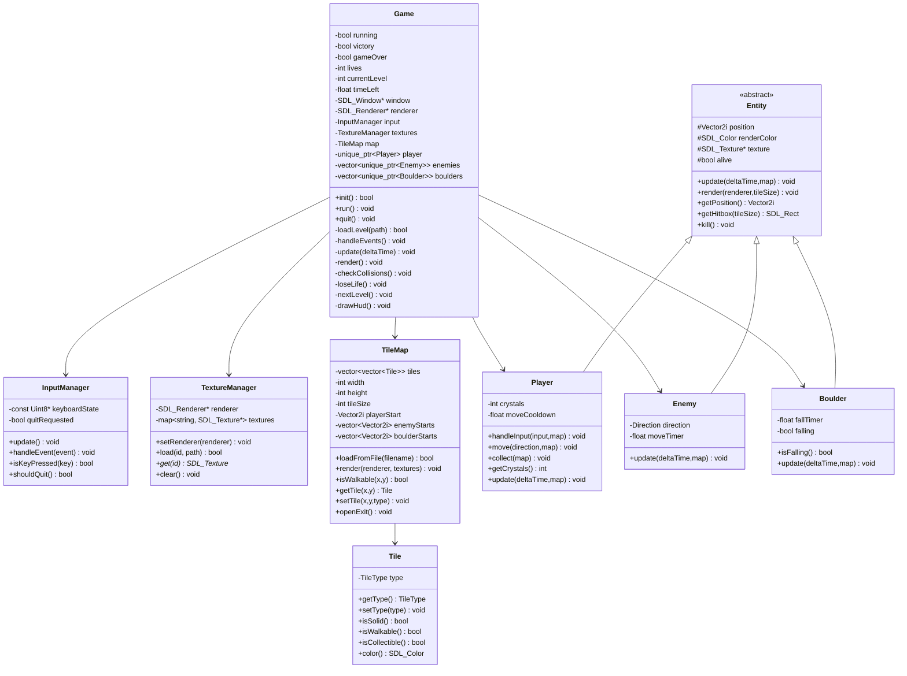

# Crystal Caverns – Projektdokumentation

**Projekt:** Crystal Caverns  
**Sprache:** C++17  
**Bibliothek:** SDL2  
**Repository:** <https://github.com/Mc-smail/CrystalCaverns>  
**Genre:** 2D Retro Tile Adventure  

---

## 1. Kurzbeschreibung

**Crystal Caverns** ist ein kleines 2D-Spiel in C++ mit SDL2. Der Spieler bewegt sich durch eine Höhle, sammelt Kristalle, vermeidet Gegner und fallende Steine und erreicht den Ausgang. Nach Abschluss des ersten Levels startet automatisch ein schwierigeres zweites Level.

Das Spiel wurde so entwickelt, dass wichtige Konzepte aus der 2D-Game-Development-Vorlesung praktisch angewendet werden:

- Game Loop: `Input → Update → Render`
- SDL2-Fenster und Renderer
- Event-Handling und Keyboard-State
- Tilemap aus Textdateien
- Sprites/Texturen mit SDL
- Kollisionen
- Klassen, Vererbung und Polymorphismus
- moderne C++-Struktur mit Header-/Source-Trennung
- `std::vector` und `std::unique_ptr`

---

## 2. Spielziel

Der Spieler muss pro Level mindestens **7 Kristalle** sammeln. Danach öffnet sich der Ausgang. Wenn der Spieler den Ausgang erreicht, wird im ersten Level automatisch das zweite Level geladen. Nach dem zweiten Level ist das Spiel gewonnen.

Der Spieler verliert ein Leben, wenn:

- er von einem Gegner berührt wird,
- er von einem fallenden Stein getroffen wird,
- der Level-Timer abläuft.

Nach **3 verlorenen Leben** ist das Spiel vorbei.

---

## 3. Steuerung

| Taste | Funktion |
|---|---|
| `W` / Pfeil hoch | Spieler nach oben bewegen |
| `A` / Pfeil links | Spieler nach links bewegen |
| `S` / Pfeil runter | Spieler nach unten bewegen |
| `D` / Pfeil rechts | Spieler nach rechts bewegen |
| `R` | Nach Game Over / Victory neu starten |
| `ESC` | Spiel beenden |

---

## 4. Spielmechaniken

### 4.1 Tilemap

Die Spielwelt besteht aus einem Raster. Jedes Zeichen in der Leveldatei steht für ein bestimmtes Objekt.

| Zeichen | Bedeutung |
|---|---|
| `#` | Wand, nicht begehbar |
| `.` | Erde, begehbar und wird beim Betreten entfernt |
| `P` | Startposition des Spielers |
| `C` | Kristall |
| `O` | Stein / Boulder |
| `X` | Gegner |
| `E` | Ausgang |

### 4.2 Kristalle

Kristalle werden eingesammelt, wenn der Spieler das Feld betritt. Nach dem Einsammeln wird das Feld leer.

### 4.3 Ausgang

Der Ausgang ist zuerst geschlossen. Sobald der Spieler mindestens 7 Kristalle gesammelt hat, wird der Ausgang geöffnet.

### 4.4 Gegner

Gegner bewegen sich automatisch horizontal. Wenn sie auf eine Wand oder ein Hindernis treffen, wechseln sie die Richtung.

### 4.5 Steine

Steine fallen nach unten, wenn das Feld darunter frei ist. Trifft ein fallender Stein den Spieler, verliert der Spieler ein Leben.

### 4.6 Timer und Leben

Jedes Level hat ein Zeitlimit von **90 Sekunden**. Der Spieler hat **3 Leben**. Das HUD zeigt Kristalle, Leben und Timer-Leiste an.

---

## 5. Levelübersicht

| Level | Kristalle | Gegner | Steine | Schwierigkeit |
|---|---:|---:|---:|---|
| Level 1 | 8 | 3 | 4 | Mittel |
| Level 2 | 10 | 3 | 5 | Schwer |

Level 2 ist schwieriger, weil es mehr Kristalle, mehr Steine und engere Wege enthält.

---

## 6. Technische Architektur

Das Projekt ist objektorientiert aufgebaut. Die wichtigsten Klassen sind:

- `Game`
- `InputManager`
- `TextureManager`
- `Tile`
- `TileMap`
- `Entity`
- `Player`
- `Enemy`
- `Boulder`

### 6.1 Game Loop

Die Hauptschleife befindet sich in `Game::run()`:

```cpp
while (running) {
    handleEvents();
    update(deltaTime);
    render();
}
```

Die Schleife besteht aus drei Phasen:

1. **Input:** Tastatur und SDL-Events lesen.
2. **Update:** Weltzustand verändern, Bewegung und Kollisionen berechnen.
3. **Render:** Map, Entities und HUD zeichnen.

---

## 7. UML-Klassendiagramm



---

## 8. Klassenbeschreibung

### 8.1 `Game`

Die Klasse `Game` steuert das komplette Spiel. Sie initialisiert SDL, lädt Level, verwaltet den Game Loop und entscheidet über Sieg, Niederlage und Levelwechsel.

**Wichtige Attribute:**

- `running`: steuert, ob die Game Loop läuft.
- `victory`: zeigt an, ob das Spiel gewonnen ist.
- `gameOver`: zeigt an, ob das Spiel verloren ist.
- `lives`: Anzahl der Leben.
- `currentLevel`: aktuelles Level.
- `timeLeft`: verbleibende Zeit im Level.
- `map`: aktuelle Tilemap.
- `player`: Spielerobjekt.
- `enemies`: Liste aller Gegner.
- `boulders`: Liste aller Steine.

**Wichtige Methoden:**

- `init()` initialisiert SDL und lädt das erste Level.
- `run()` enthält die Hauptschleife.
- `update()` aktualisiert Weltzustand, Timer und Entities.
- `render()` zeichnet Spielwelt und HUD.
- `loadLevel()` lädt ein Level aus einer Textdatei.
- `loseLife()` reduziert Leben und lädt ggf. das Level neu.
- `nextLevel()` wechselt zu Level 2 oder Victory.

---

### 8.2 `InputManager`

Diese Klasse kapselt SDL-Input. Dadurch muss nicht jede Klasse direkt mit SDL-Events arbeiten.

**Aufgaben:**

- SDL-Events verarbeiten.
- Tastaturzustand abfragen.
- Quit-Events erkennen.

---

### 8.3 `TextureManager`

Der `TextureManager` lädt BMP-Dateien mit SDL und verwaltet sie über IDs.

```cpp
SDL_Surface* surface = SDL_LoadBMP(path.c_str());
SDL_Texture* texture = SDL_CreateTextureFromSurface(renderer, surface);
```

Vorteil: Texturen werden zentral geladen und können überall wiederverwendet werden.

---

### 8.4 `Tile` und `TileMap`

`Tile` repräsentiert ein einzelnes Feld. `TileMap` verwaltet alle Felder als 2D-Datenstruktur.

```cpp
std::vector<std::vector<Tile>> tiles;
```

`TileMap::loadFromFile()` liest Leveldateien ein und erzeugt daraus Map, Spielerstart, Gegner und Steine.

---

### 8.5 `Entity`

`Entity` ist die abstrakte Basisklasse für bewegliche Spielobjekte. Dadurch können Spieler, Gegner und Steine einheitlich behandelt werden.

**Abgeleitete Klassen:**

- `Player`
- `Enemy`
- `Boulder`

---

### 8.6 `Player`

Der Spieler verarbeitet Eingaben, bewegt sich durch die Map und sammelt Kristalle.

---

### 8.7 `Enemy`

Ein Gegner bewegt sich automatisch horizontal und kehrt bei Hindernissen um.

---

### 8.8 `Boulder`

Ein Stein fällt nach unten, wenn das Feld darunter frei ist. Ein fallender Stein ist gefährlich für den Spieler.

---

## 9. Projektstruktur

```text
CrystalCaverns/
├── CMakeLists.txt
├── README.md
├── assets/
│   ├── levels/
│   │   ├── level01.txt
│   │   └── level02.txt
│   └── sprites/
│       ├── boulder.bmp
│       ├── crystal.bmp
│       ├── dirt.bmp
│       ├── empty.bmp
│       ├── enemy.bmp
│       ├── exit_closed.bmp
│       ├── exit_open.bmp
│       ├── player.bmp
│       └── wall.bmp
├── include/
│   ├── Boulder.hpp
│   ├── Enemy.hpp
│   ├── Entity.hpp
│   ├── Game.hpp
│   ├── InputManager.hpp
│   ├── Player.hpp
│   ├── TextureManager.hpp
│   ├── Tile.hpp
│   ├── TileMap.hpp
│   └── Types.hpp
└── src/
    ├── Boulder.cpp
    ├── Enemy.cpp
    ├── Entity.cpp
    ├── Game.cpp
    ├── InputManager.cpp
    ├── main.cpp
    ├── Player.cpp
    ├── TextureManager.cpp
    ├── Tile.cpp
    └── TileMap.cpp
```

---

## 10. Build- und Startanleitung

### macOS mit Homebrew

```bash
brew install cmake sdl2
cd "CrystalCaverns"
mkdir -p build
cd build
cmake ..
cmake --build .
cd ..
./build/CrystalCaverns
```

### Ubuntu / Kali / Debian

```bash
sudo apt update
sudo apt install -y build-essential cmake libsdl2-dev
cd CrystalCaverns
mkdir -p build
cd build
cmake ..
cmake --build .
cd ..
./build/CrystalCaverns
```

---

## 11. Wichtige Codeausschnitte

### 11.1 Game Loop

```cpp
void Game::run() {
    Uint64 previous = SDL_GetPerformanceCounter();

    while (running) {
        Uint64 current = SDL_GetPerformanceCounter();
        float deltaTime = static_cast<float>(current - previous) /
            static_cast<float>(SDL_GetPerformanceFrequency());
        previous = current;

        handleEvents();
        update(deltaTime);
        render();
    }
}
```

### 11.2 Level laden

```cpp
bool TileMap::loadFromFile(const std::string& filename) {
    std::ifstream file(filename);
    if (!file) return false;

    std::string line;
    int y = 0;
    while (std::getline(file, line)) {
        std::vector<Tile> row;
        for (int x = 0; x < static_cast<int>(line.size()); ++x) {
            char c = line[x];
            // Zeichen werden in Tiles oder Entities übersetzt
        }
        tiles.push_back(row);
        ++y;
    }
    return true;
}
```

### 11.3 Spielerbewegung

```cpp
void Player::move(Direction direction, TileMap& map) {
    int newX = position.x;
    int newY = position.y;

    switch (direction) {
        case Direction::Up:    --newY; break;
        case Direction::Down:  ++newY; break;
        case Direction::Left:  --newX; break;
        case Direction::Right: ++newX; break;
        case Direction::None: return;
    }

    if (map.isWalkable(newX, newY)) {
        position.x = newX;
        position.y = newY;
        collect(map);
    }
}
```

---

## 12. Designentscheidungen

### 12.1 Warum SDL2?

SDL2 stellt die grundlegenden Funktionen bereit, die für ein 2D-Spiel nötig sind:

- Fenster
- Renderer
- Events
- Tastatur
- Texturen

Gleichzeitig bleibt SDL2 niedrigschwellig genug, um die Architektur selbst zu verstehen.

### 12.2 Warum BMP statt SDL2_image?

Das Projekt nutzt BMP-Dateien, weil SDL2 diese direkt laden kann. Dadurch wird keine zusätzliche Bibliothek wie SDL2_image benötigt. Das vereinfacht Build und Installation.

### 12.3 Warum `std::unique_ptr`?

Dynamische Spielobjekte wie Gegner und Steine werden über Smart Pointer verwaltet. Dadurch wird Speicher automatisch freigegeben.

---

## 13. Erweiterungsmöglichkeiten

- mehr Level
- Menü mit Text über SDL_ttf
- Soundeffekte mit SDL_mixer
- bessere Gegner-KI
- Highscore-System
- Level-Editor
- Animationen mit Spritesheets
- Schlüssel-Tür-System
- verschiedene Steinarten
- zufällig generierte Höhlen
- Speichern und Laden

---

## 14. Fazit

Crystal Caverns ist ein vollständiges kleines C++/SDL2-Spielprojekt. Es zeigt die wichtigsten Grundlagen moderner 2D-Spieleentwicklung: Game Loop, Input, Rendering, Tilemaps, Kollisionen, Entities und objektorientierte Struktur. Durch zwei Level, Timer, Leben und steigende Schwierigkeit ist das Spiel nicht nur eine technische Demo, sondern tatsächlich spielbar.
